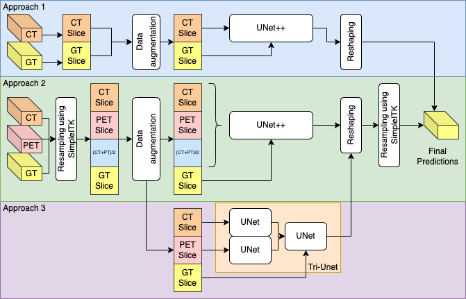
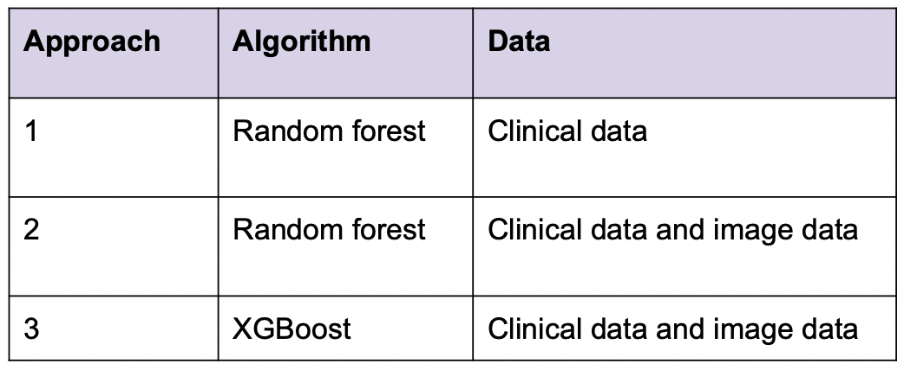

# Official repository for the paper titled: MLC at HECKTOR 2022: The Effect and Importance of Training Data when Analyzing Cases of Head and Neck Tumors using Machine Learning

## Task 1

Approaches:

## Task 2

Approaches: 

### Contact us:
vajira@simula.no /
andrea@simula.no /
steven@simula.no /
paalh@simula.no /
michael@simula.no

